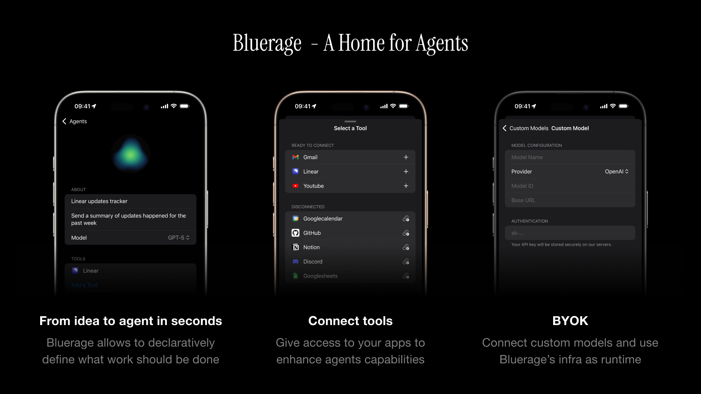

# Bluerage iOS

  

Mobile first AI-powered automation that thinks and acts for you. Create
workflows that run in the background, connecting your favorite tools and
services - all from your phone.

## Download

## What is Bluerage?

Bluerage transforms automation by combining the simplicity of visual workflows
with the intelligence of AI. Think of it as Apple Shortcuts enhanced with AI
capabilities - create agents that understand your goals, make decisions, and
execute complex tasks autonomously in the cloud.

## Key Features

### Mobile First

Designed from the ground up for iOS. Share content directly to your agents,
trigger workflows on the go, and manage automations from anywhere with a native
mobile experience.

### Bring Your Own Keys

Full control over your AI usage and costs. Connect your own API keys for OpenAI,
Anthropic, or other providers.

### Declarative Automation

Define your goal in natural language and let AI handle the complexity. Your
agents understand context, make decisions, and passes data between steps for
you. No node-based architecture!

### Cloud-Based Execution

Agents run in the cloud via Convex, continuing their work even after you close
the app. Start a task and come back to see the results.

### Tool Integration

Connect your existing applications and services through a growing library of
tools. Each agent can access multiple tools to accomplish complex, multi-step
workflows.

### Rapid Prototyping

Go from idea to working automation in minutes. The intuitive interface makes it
simple to draft, test, and refine your agents without any coding knowledge.

## How It Works

### Creating an Agent

1. **Define Agent's Goal**\
   Start with a clear objective written in plain language. The AI understands
   what you want to achieve.

2. **Choose Your Model**\
   Select from available AI models or define a custom one to power your agent.

3. **Connect Tools**\
   Add the tools your agent needs - integrations that enable real-world actions.

4. **Design Workflow Steps**\
   Outline the process with simple steps. No need to pass parameters between
   steps (nodes).

5. **Run**\
   Launch immediately or schedule for later. Your agent works autonomously in
   the cloud.

## Getting Started

Ready to build and run Bluerage locally? Check out our [Local Development Guide](docs/local-development.md) for detailed setup instructions.

## Localization

Bluerage is currently localized in the following languages:

| Name                                    | Code |
| --------------------------------------- | ---- |
| [English](Bluerage/Resources/en.lproj/) | en   |

> If a language has mistakes or is missing, feel free to create an issue or open
> a pull request.

## Related Projects

- [Bluerage Backend](https://github.com/blueragesoftware/backend)

## Acknowledgments

- [Tuist](https://github.com/tuist/tuist)
- [Convex Swift](https://github.com/blueragesoftware/convex-swift)
- [Factory](https://github.com/hmlongco/Factory)
- [Nuke](https://github.com/kean/Nuke)
- [PinLayout](https://github.com/layoutBox/PinLayout)
- [PostHog iOS](https://github.com/PostHog/posthog-ios)
- [Sentry Cocoa](https://github.com/getsentry/sentry-cocoa)
- [SwiftUI Shimmer](https://github.com/markiv/SwiftUI-Shimmer)
- [Clerk iOS](https://github.com/blueragesoftware/clerk-ios)
- [SVGView](https://github.com/exyte/SVGView)
- [Swift Markdown UI](https://github.com/gonzalezreal/swift-markdown-ui)
- [Navigator](https://github.com/hmlongco/Navigator)
- [Swift Package List](https://github.com/FelixHerrmann/swift-package-list)
- [Swift Introspect](https://github.com/siteline/swiftui-introspect)

## Community

- X: [@blueragehq](https://x.com/blueragehq)
- Threads: [@blueragehq](https://threads.com/blueragehq)
- Discord: [Bluerage Channel](https://discord.gg/sCutZ3zd)
- Website: [bluerage.software](https://bluerage.software)
- Feedback: [feedback@bluerage.software](mailto:feedback@bluerage.software)

## License

Apache License 2.0 - See [LICENSE](LICENSE) for details
